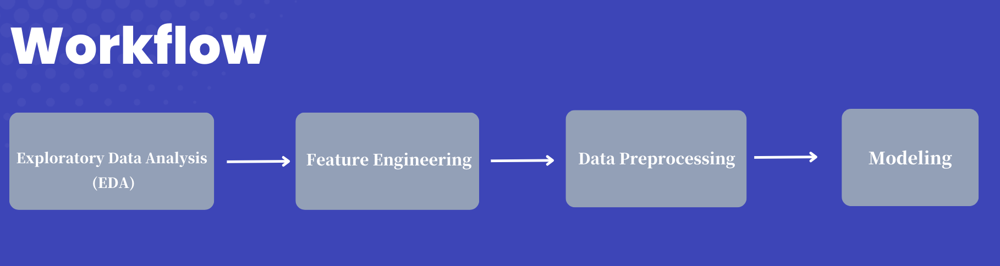

<!-- Improved compatibility of back to top link: See: https://github.com/othneildrew/Best-README-Template/pull/73 -->
<a id="readme-top"></a>
<!--
*** Thanks for checking out the Best-README-Template. If you have a suggestion
*** that would make this better, please fork the repo and create a pull request
*** or simply open an issue with the tag "enhancement".
*** Don't forget to give the project a star!
*** Thanks again! Now go create something AMAZING! :D
-->


<!-- PROJECT SHIELDS -->
<!--
*** I'm using markdown "reference style" links for readability.
*** Reference links are enclosed in brackets [ ] instead of parentheses ( ).
*** See the bottom of this document for the declaration of the reference variables
*** for contributors-url, forks-url, etc. This is an optional, concise syntax you may use.
*** https://www.markdownguide.org/basic-syntax/#reference-style-links
-->

[![LinkedIn][linkedin-shield]][linkedin-url]


<!-- PROJECT LOGO -->
<br />
<div align="center">
  <a href="https://github.com/stephanie0215/Customer-Churn-Analysis-and-Retention-Strategy/tree/main">
    
  </a>

<h3 align="center">Customer Churn Analysis and Retention Strategy</h3>

  <p align="center">
    <p align="left">
        This project aims to identify key drivers behind customer churn and develop data-driven strategies for customer retention. A central hypothesis of this analysis is that price sensitivity may be a significant factor in customer churn.
    <br />
        To validate this hypothesis, I’ll use feature importance scores within a predictive model to assess the relationship between churn and various customer attributes. Additionally, resampling techniques will be applied to handle imbalanced data and enhance model performance, allowing for more targeted retention strategies.
    </p>
    <br />
    <!--
    <a href="https://github.com/github_username/repo_name"><strong>Explore the docs »</strong></a>
    <br />
    <br />
    <a href="https://github.com/github_username/repo_name">View Demo</a>
    ·
    <a href="https://github.com/github_username/repo_name/issues/new?labels=bug&template=bug-report---.md">Report Bug</a>
    ·
    <a href="https://github.com/github_username/repo_name/issues/new?labels=enhancement&template=feature-request---.md">Request Feature</a>
    -->
  </p>
</div>


##### Built With


<a href="https://www.python.org/">
  
</a>


<p align="right">(<a href="#readme-top">back to top</a>)</p>


<!-- TABLE OF CONTENTS -->
<details>
  <summary>Table of Contents</summary> 
  <ol>
    <li>
      <a href="#key-findings-and-recommendations">Key Findings and Recommendations</a>
    </li>
    <li>
      <a href="#project-overview">Project Overview</a>
      <ul>
        <li><a href="#eda">EDA</a></li>
        <li><a href="#feature-engineering">Feature Engineering</a></li>
        <li><a href="#data-preprocessing">Data Preprocessing</a></li>
        <li><a href="#modeling">Modeling</a></li>
      </ul>
    </li>
    <li><a href="#installation-guide">Installation Guide</a></li>
    <li><a href="#contact">Contact</a></li>
    <li><a href="#acknowledgments">Acknowledgments</a></li>
  </ol>
</details>


<!-- ABOUT THE PROJECT -->


## Key Findings and Recommendations

1. **Key Predictive Variables**:
The most important variables for predicting customer churn are `Net Margin`, `Yearly Consumption`, and `Forecasted Consumption`. Notably, `Customer Price Sensitivity` was found **not** to be a key factor in predicting churn.

2. **Retention Strategy**:
To retain customers, we recommend offering a 20% discount to high-value customers—those with a net margin at or above the third quartile (Q3) and identified as being at risk of churning.

3. **Model Performance and Budget Impact**:
Our model can help identify up to 65% of high-value customers who are likely to churn. Additionally, it significantly improves targeting precision compared to offering discounts to all high-value customers indiscriminately (baseline precision: 0.1).
    - Choosing the Resampling Method:
        - **With an Abundant Budget**: If the marketing team has substantial resources, high recall is ideal. Using `Random Undersampling` achieves a recall of 0.65 but has a precision of only 0.14. This approach allows the team to maximize customer retention by reaching a broader range of potential churners, even if some may not actually churn. The larger budget can cover the costs of reaching a wider audience.
        - **With a Limited Budget**: For tighter budgets, `SMOTEENN` is recommended, as it offers a more balanced approach with a recall of 0.3 and a precision of 0.19. This balance helps ensure a high return on investment (ROI) by focusing on customers most likely to churn, making each dollar spent more impactful.
4. **Model Optimization**:
To prevent overfitting while maintaining high accuracy, precision, and recall, we use the top 20 variables with the highest importance scores in our final model.


<p align="right">(<a href="#readme-top">back to top</a>)</p>


## Project Overview

<div align="center">

<a href="https://github.com/stephanie0215/Customer-Churn-Analysis-and-Retention-Strategy/tree/main">
  
</a>

This project follows the workflow outlined below:

<div style="display: inline-block; text-align: left">

- **Exploratory Data Analysis (EDA)** 
- **Feature Engineering** 
- **Data Preprocessing** 
- **Modeling**

</div>

</div>

### EDA
- **Univariate Analysis**: Explore the distribution of each variable and analyze how `churn` is associated with each feature.
- For more details, please refer to the [EDA.ipynb](https://github.com/stephanie0215/Customer-Churn-Analysis-and-Retention-Strategy/blob/main/EDA.ipynb).

### Feature Engineering
- Create variables that capture price differentials, reflecting customer price sensitivity.
- Transform `datetime` features into numeric values representing the number of months (as integers).
- For more details, please refer to the [Feature Engineering & Data Preprocessing.ipynb](https://example.com).

### Data Preprocessing
- **Encoding Categorical Data**: Apply encoding techniques like one-hot encoding to convert categorical variables into numerical representations suitable for modeling.
- **Addressing Skewness in Numerical Data**: Apply transformations to reduce skewness and align with model assumptions.
- **Correlation Analysis**: Drop features with high correlation to ensure variable independence and avoid multicollinearity.
- For more details, please refer to the [Feature Engineering & Data Preprocessing.ipynb](https://example.com).

### Modeling
- Construct a **Random Forest** classification model.
- **Evaluate Feature Engineering**: Compare model performance using features created through feature engineering versus models without these features.
- **Feature Importance**: Analyze which features are most influential in the model's predictions.
- Investigate why `Customer Price Sensitivity` was not a key factor in predicting churn by visualizing the relationship between price sensitivity features and churn.
- **Simplify the Model**: Reduce complexity by selecting only the most important features.
- **Handle Imbalanced Data**: Use various resampling techniques to improve model performance.
- **Formulate a Marketing Strategy**: Develop a strategy for customer retention and recommend the appropriate resampling method based on the marketing department’s budget constraints.
- For more details, please refer to the [Modeling.ipynb](https://github.com/stephanie0215/Customer-Churn-Analysis-and-Retention-Strategy/blob/main/Modeling.ipynb).


<p align="right">(<a href="#readme-top">back to top</a>)</p>


## Installation Guide

1. **Install Python**:
   - Download Python 3.10.15 from the [official Python website](https://www.python.org/downloads/release/python-31015/).
   - Follow the installation instructions specific to your operating system (macOS, Windows, Linux).

2. **Install Anaconda** (optional but recommended):
   - Download Anaconda from the [Anaconda website](https://www.anaconda.com/products/distribution) for an easy environment and package management system.
   - Follow the installation instructions for your operating system.

3. **Install Required Python Packages**:
   - Open a terminal or command prompt and create a virtual environment:
     ```sh
     python -m venv project_env
     ```
   - Activate the environment:
     - On Windows:
       ```sh
       project_env\Scripts\activate
       ```
     - On macOS/Linux:
       ```sh
       source project_env/bin/activate
       ```
   - Install the necessary packages with the specified versions:
     ```sh
     pip install pandas==2.2.2 
                 numpy==1.26.4 
                 seaborn==0.13.2 
                 matplotlib==3.9.2 
                 scikit-learn==1.5.1 
                 imbalanced-learn==0.12.4 
                 scipy==1.13.1 
                 python-dateutil==2.9.0post0 
                 pyyaml==6.0.2
     ```
4. **Install Jupyter Notebook**:
   - Install Jupyter Notebook by running the following command:
     ```sh
     pip install notebook
     ```
   - Then, start the notebook with:
     ```sh
     jupyter notebook
     ```

<p align="right">(<a href="#readme-top">back to top</a>)</p>

## Contact

Yung-Hui (Stephanie Pan)- [@linkedin](https://www.linkedin.com/in/stephanieyhpan) - stephanie22335@gmail.com

Project Link: [https://github.com/stephanie0215/Customer-Churn-Analysis-and-Retention-Strategy/tree/main](https://github.com/stephanie0215/Customer-Churn-Analysis-and-Retention-Strategy/tree/main)

<p align="right">(<a href="#readme-top">back to top</a>)</p>


<!-- ACKNOWLEDGMENTS -->
## Acknowledgments

* This project was inspired by the [BCG Data Science Job Simulation on Forage](https://www.theforage.com/simulations/bcg/data-science-ccdz), which provides hands-on experience with real-world data science tasks in a business context.


<p align="right">(<a href="#readme-top">back to top</a>)</p>


<!-- MARKDOWN LINKS & IMAGES -->
<!-- https://www.markdownguide.org/basic-syntax/#reference-style-links -->
[contributors-shield]: https://img.shields.io/github/contributors/github_username/repo_name.svg?style=for-the-badge
[contributors-url]: https://github.com/github_username/repo_name/graphs/contributors
[forks-shield]: https://img.shields.io/github/forks/github_username/repo_name.svg?style=for-the-badge
[forks-url]: https://github.com/github_username/repo_name/network/members
[stars-shield]: https://img.shields.io/github/stars/github_username/repo_name.svg?style=for-the-badge
[stars-url]: https://github.com/github_username/repo_name/stargazers
[issues-shield]: https://img.shields.io/github/issues/github_username/repo_name.svg?style=for-the-badge
[issues-url]: https://github.com/github_username/repo_name/issues
[license-shield]: https://img.shields.io/github/license/github_username/repo_name.svg?style=for-the-badge
[license-url]: https://github.com/github_username/repo_name/blob/master/LICENSE.txt
[linkedin-shield]: https://img.shields.io/badge/-LinkedIn-black.svg?style=for-the-badge&logo=linkedin&colorB=555
[linkedin-url]: https://www.linkedin.com/in/stephanieyhpan
[product-screenshot]: images/screenshot.png
[Pandas-logo]: https://upload.wikimedia.org/wikipedia/commons/thumb/e/ed/Pandas_logo.svg/320px-Pandas_logo.svg.png
[Pandas-url]: https://pandas.pydata.org/docs/getting_started/index.html
[Sklearn-logo]: https://upload.wikimedia.org/wikipedia/commons/thumb/0/05/Scikit_learn_logo_small.svg/260px-Scikit_learn_logo_small.svg.png
[Sklearn-url]: https://scikit-learn.org/stable/

